## Data Science / Veri Bilimi
<br>
<br>


:::footer
[Kaynak](https://r4ds.hadley.nz/intro.html)
:::

## Where does the time go?

<br>

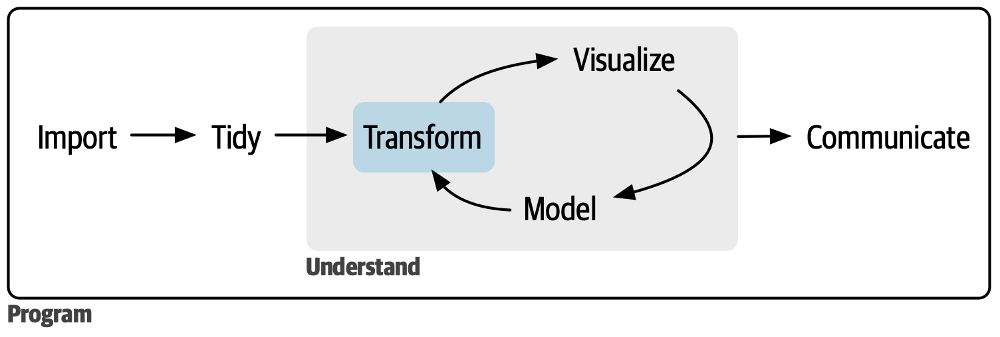{width="70%"}

<br>

Surveys put **~80% of analysis time** into getting the data ready: importing, tidying and transforming.

`tidyverse` makes you efficient in exactly that **80%**.

:::footer
[Kaynak](https://www.nytimes.com/2014/08/18/technology/for-big-data-scientists-hurdle-to-insights-is-janitor-work.html)
:::

## {background-image="images/brosur-ucgen.png" background-size=contain}

## {background-image="images/text4289-0-9-71.png" background-size=contain}

## Why R? / Neden R?

:::{style="font-size: 18pt;"}

| Tool | Shines at | But |
|:---|:---|:---|
| Linux terminal (`grep`, `awk`, `sed`) | quick jobs on huge text files | no statistics or graphics, hard to reuse |
| Excel | small tables, quick charts, sharing | silent errors — turns gene symbols into dates ([~1 in 5 papers!](https://genomebiology.biomedcentral.com/articles/10.1186/s13059-016-1044-7)), not reproducible |
| Python (`pandas` + Jupyter) | general purpose scripting, machine learning | thinner tooling for genomics and statistics |
| SQL (`duckdb`, databases) | the lingua franca of data analysis: query databases and even CSV files directly (DuckDB), scales beyond memory | no statistics or graphics — pair it with R |
| **R** (`tidyverse` + `RStudio`) | statistics, visualization, [Bioconductor](https://www.bioconductor.org/) with 2,000+ biology packages | base-R quirks — which we avoid with `tidyverse` |

:::

All five can analyze data. We'll see SQL again in this course; for biology we pick **R**: Bioconductor, reproducible scripts, free.

## Same analysis, four languages

*Per condition: how many genes, how many with expression above 350, and what fraction?*

:::: {.panel-tabset}

## R — tidyverse

```r
read_csv("expr.csv") |>
  group_by(condition) |>
  summarise(n         = n(),
            n_high    = sum(expr > 350),
            frac_high = mean(expr > 350))
```

*Reads like the question — no dialect, no hidden steps.*

## Python — pandas

```python
import pandas as pd

df = pd.read_csv("expr.csv")
df.groupby("condition").agg(
    n         = ("gene", "size"),
    n_high    = ("expr", lambda s: (s > 350).sum()),
    frac_high = ("expr", lambda s: (s > 350).mean()),
)
```

*Same idea, but the two lambdas hide inside `agg`.*

## SQL

```sql
SELECT condition,
       COUNT(*) AS n,
       SUM(CASE WHEN expr > 350 THEN 1 ELSE 0 END)   AS n_high,
       AVG(CASE WHEN expr > 350 THEN 1.0 ELSE 0 END) AS frac_high
FROM expr
GROUP BY condition;
```

*`CASE WHEN` boilerplate, twice.*

## awk — Linux terminal

```awk
awk -F, 'NR>1{n[$2]++; if($3>350) h[$2]++}
END{for(g in n) printf "%s %d %d %.2f\n", g, n[g], h[g], h[g]/n[g]}' expr.csv
```

*`$2`/`$3` column indexes and manual accumulators.*

::::

All four give the same answer — the difference is what you can still read tomorrow.

## What is reproducibility?

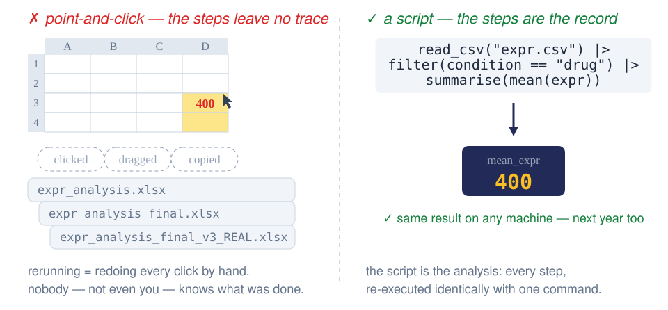{width="94%"}

## How to run R

<br>

:::: {.columns}

::: {.column width="50%"}
**On your own computer**

1. Install **R**: [cran.r-project.org](https://cran.r-project.org/)
2. Install **RStudio Desktop**: [posit.co/download/rstudio-desktop](https://posit.co/download/rstudio-desktop/)

Free, fast, works offline.
:::

::: {.column width="50%"}
**In the cloud**

**[Posit Cloud](https://posit.cloud/)** — a full RStudio session in your browser, nothing to install. Free student plan.
:::

::::

<br>

Or use nothing at all: **these slides run R themselves** →

## R, running inside these slides

These slides carry their own R engine: **webR** — R compiled to WebAssembly, running in your browser. No installation, no cloud account.

```{webr-r}
library(dplyr)
starwars |>
  filter(species == "Human") |>
  count(eye_color, sort = TRUE)
```

:::footer
[quarto-webr extension](https://quarto-webr.thecoatlessprofessor.com/) — first run downloads the R engine, give it a few seconds
:::

## Tidyverse paketleri

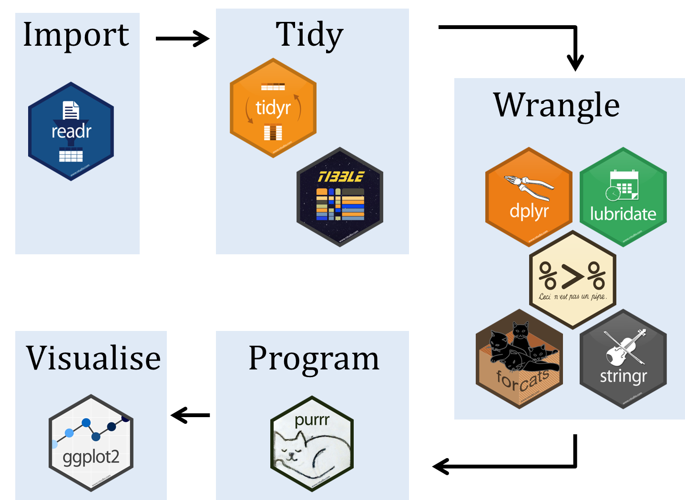

:::footer
http://www.seec.uct.ac.za/r-tidyverse
:::

## Cleaning the data

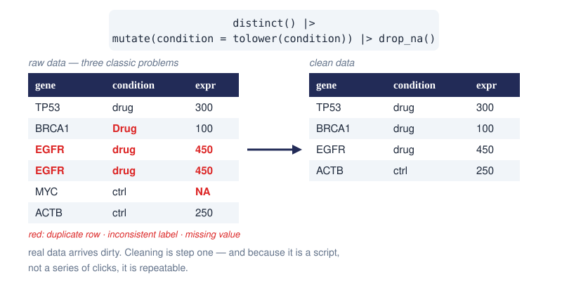{width="85%"}

## What is tidy?

<br>

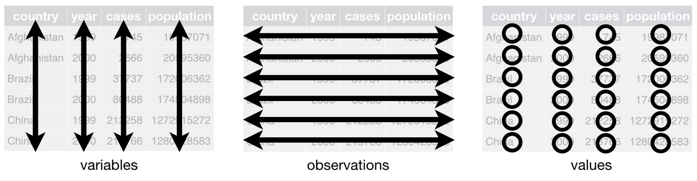

:::{style="font-size: 18pt;"}

- **Variables** are the **columns** — everything you measured: `gene`, `condition`, `expr`
- **Observations** are the **rows** — one row per unit: one sample
- **Values** are the **cells** — a single value at each variable × observation crossing

:::

:::footer
R for Data Science https://r4ds.had.co.nz/
:::

## Untidy examples

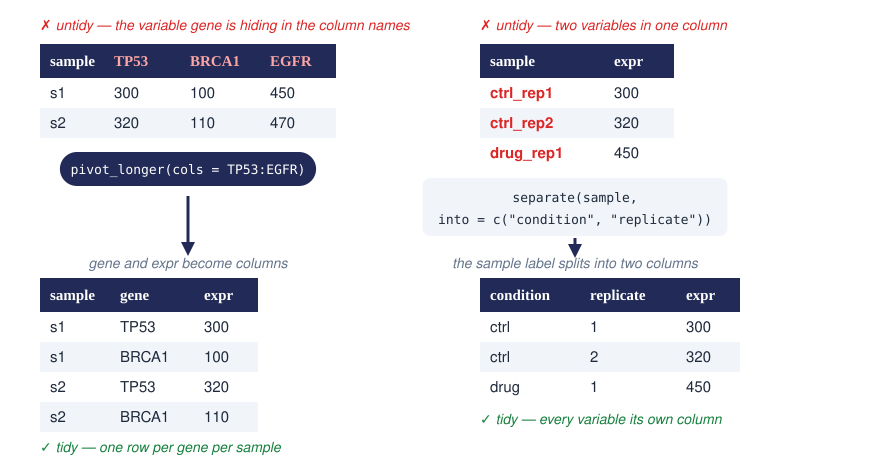{width="88%"}

## Pillars of data analysis 

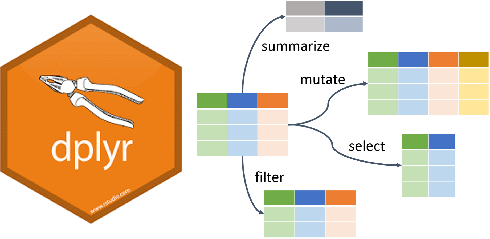

:::footer
https://www.tychobra.com/posts/2020-05-27-new-dplyr-features/
:::

##

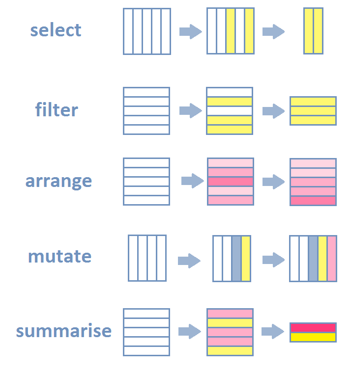

:::footer
https://rpubs.com/ekraichak/data-manipulation
:::

## Common dplyr verbs 

:::{style="font-size: 18pt;"}

| verb| action| example |
|:---|:----|:----------------|
|     `filter()`|    Select rows based on some criteria| `filter(age > 40 & treatment == "drug")`|
|     `arrange()`|    Sort rows| `arrange(date, group)`|
|     `select()`|    Select columns (and ignore all others)| `select(age, treatment)`|
|     `rename()`|    Rename columns| `rename(date = DATE_MONTHS_trial24)`|
|     `mutate()`|    Add new columns| `mutate(height.m = height.cm / 100)`|
|     `group_by(), summarise()`|   Group data and then calculate summary statistics|`group_by(treatment) |> summarise(...)` |
:::

## filter(): keep matching rows

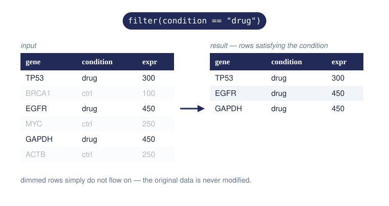{width="85%"}

## select(): keep columns

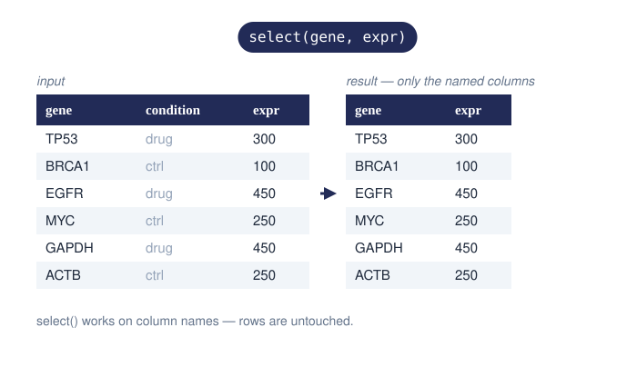{width="78%"}

## mutate(): compute new columns

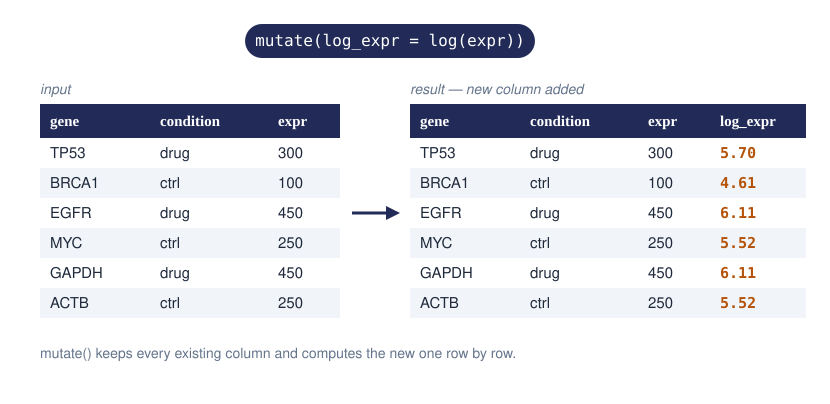{width="90%"}

## group_by() + summarise(): collapse groups

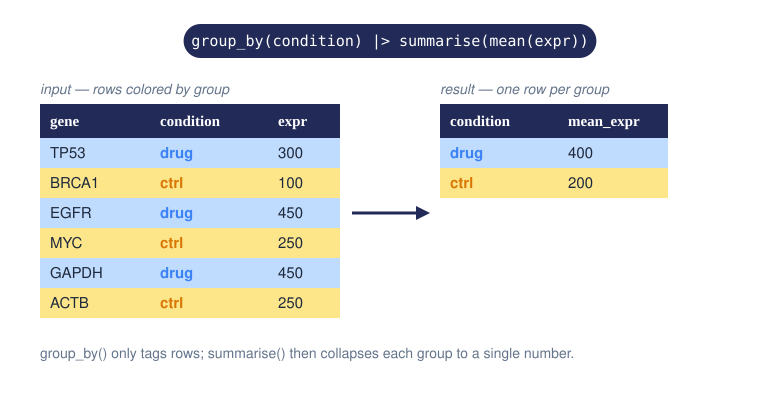{width="85%"}

## Helper functions

`select` might look simple but it becomes very useful with helper functions

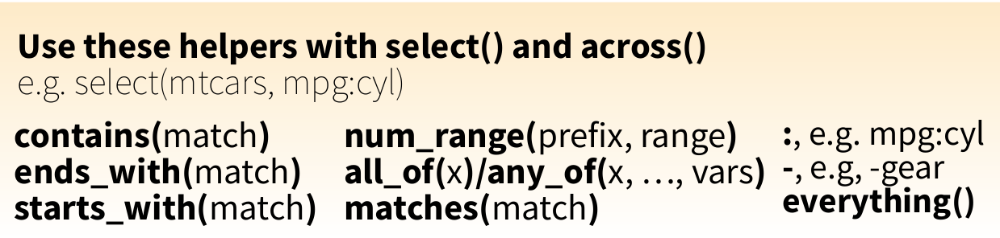

:::footer
[RStudio Cheatsheets: Data transformation with dplyr cheatsheet](https://www.rstudio.com/resources/cheatsheets/)
:::

## Group by

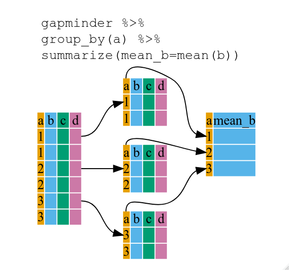

:::footer
[R for Reproducible Scientific Analysis](https://swcarpentry.github.io/r-novice-gapminder/13-dplyr/index.html)
:::

## Connecting verbs/actions - the pipe

<br>

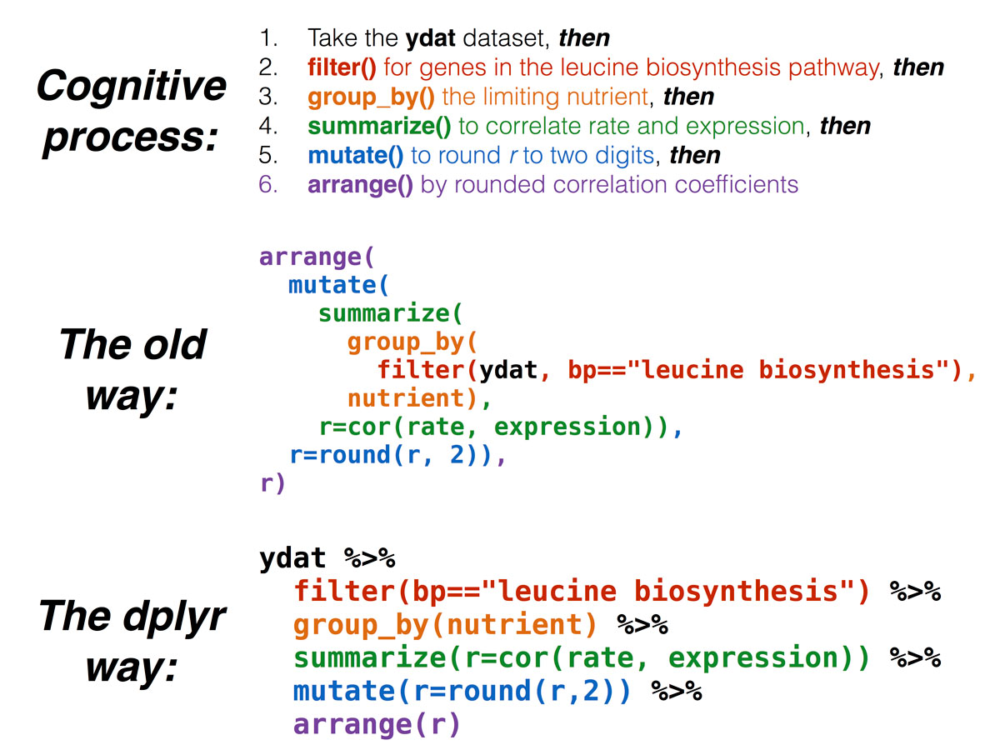

:::footer
[Data Manipulation with dplyr](https://4va.github.io/biodatasci/r-dplyr-yeast.html)
:::

## In other words

```r
white_and_yolk <- crack(egg, add_seasoning)
omelette_batter <- beat(white_and_yolk)
omelette_with_chives <- cook(omelette_batter,add_chives)
```

versus

```r
egg |>
  crack(add_seasoning) |>
  beat() |>
  cook(add_chives) -> omelette_with_chives
```
:::footer
[Lise Vaudor's blog](http://perso.ens-lyon.fr/lise.vaudor/utiliser-des-pipes-pour-enchainer-des-instructions/)
:::

## Reshaping data

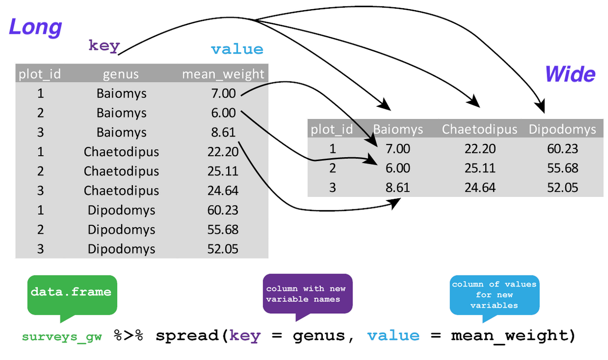

:::footer
https://datacarpentry.org/R-ecology-lesson/03-dplyr.html
:::

## Scenario 1

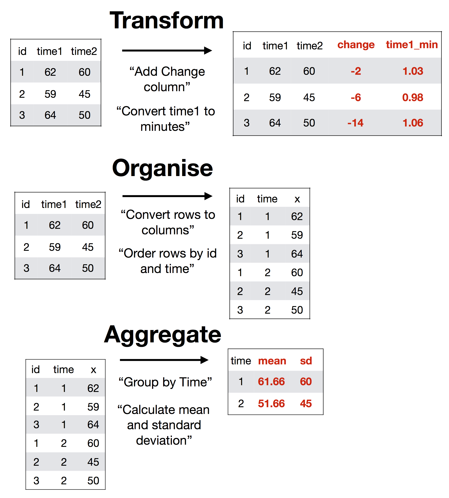

:::footer
[BaselRBootcamp April 2018](https://therbootcamp.github.io/BaselRBootcamp_2018April/_sessions/D2S1_Wrangling/Wrangling_practical_answers.html)
:::
## Scenario 2

### Working on multiple columns

:::: {.columns}

::: {.column width="40%"}
<br>
<br>
<br>


:::

::: {.column width="60%"}
```r
df |>
  group_by(g1, g2) |>
  summarise(a = mean(a), b = mean(b), c = mean(c), d = mean(d))
```

versus

```r
df |>
  group_by(g1, g2) |>
  summarise(across(a:d, mean))

# or with a function
df |>
  group_by(g1, g2) |>
  summarise(across(where(is.numeric), mean))
```
:::
::::

## Scenario 3

### Read many files at once

:::: {.columns}

::: {.column width="50%"}
```r
fs::dir_ls(data_dir,
           regexp = "\\.csv$") |>
  map_dfr(read_csv)
```
:::

::: {.column width="50%"}
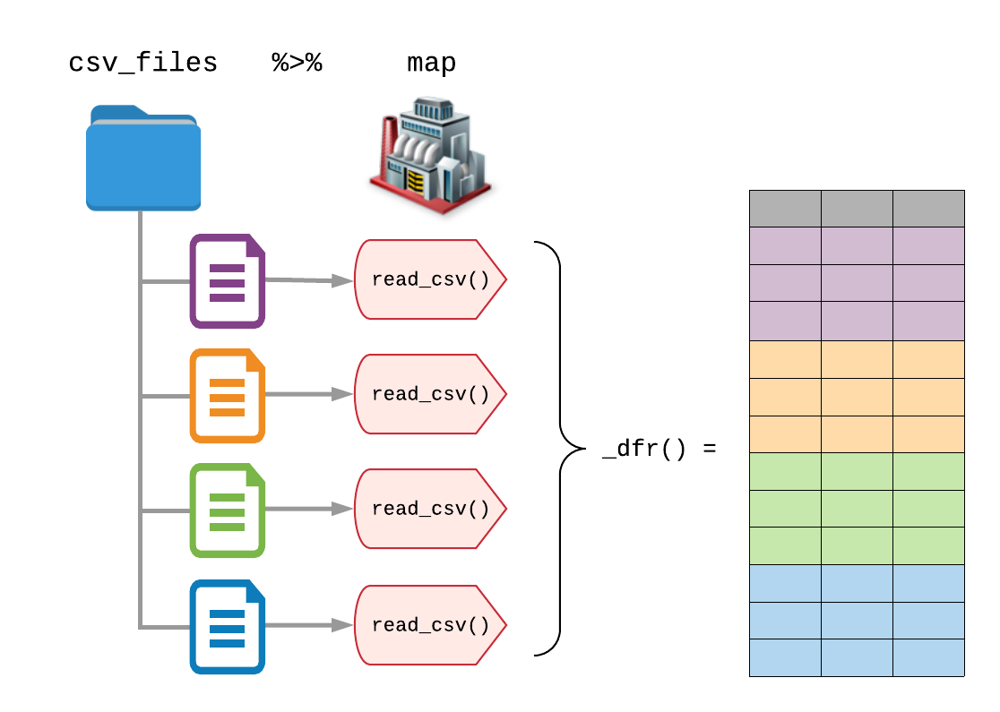
:::
::::

:::footer
https://www.gerkelab.com/blog/2018/09/import-directory-csv-purrr-readr/
:::

## Scenario 4

### Combine text analysis and graph/network analysis

There are lots of packages which follow the tidyverse principles which produce and work on tidy data.

This allows mixing packages/analysis from different domains

`tidytext` and `tidygraph` packages are great examples. Former allow text analysis by converting text data to tidy data (*very long data frame, one word per row*) and latter imports data frames to graphs and allows access to node or edge data with `dplyr` verbs.

##


```r
janeaustenr::austen_books() |>                              #tidytext
  unnest_tokens(bigram, text, token = "ngrams", n=2) |>     #tidytext
  filter(!is.na(bigram)) |>                                 #dplyr
  separate(bigram, into = c("word1","word2")) |>            #tidyr
  anti_join(stop_words, by=c("word1"="word")) |>            #dplyr
  anti_join(stop_words, by=c("word2"="word")) |>            #dplyr
  count(word1, word2, sort=T) |>                            #dplyr
  filter(n>20) |>                                           #dplyr
  as_tbl_graph() |>                                         #tidygraph
  mutate(central=centrality_degree(mode = "all")) |>        #dplyr/tidygraph
  ggraph(layout = 'nicely') +                                #ggraph
  geom_edge_link() +
  geom_node_point(aes(color=central)) +
  geom_node_label(aes(label=name), repel=T) +
  theme_graph()
```


## {background-image="images/image-20220623122330104.png" background-size=contain}

## Visualization

<br>

The popular `ggplot2` package is part of `tidyverse`.

For stunning figures in your publications, reports you're encouraged to use `ggplot2` package

## {background-image="images/image-20220623121412293.png" background-size=contain}

## Biyoloji ve tidyverse

[Bioconductor paketleri listesinde](https://www.bioconductor.org/packages/release/BiocViews.html#___Software) *"tidy"* kelimesini aratınız.
